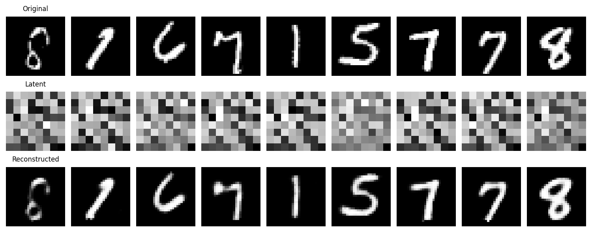
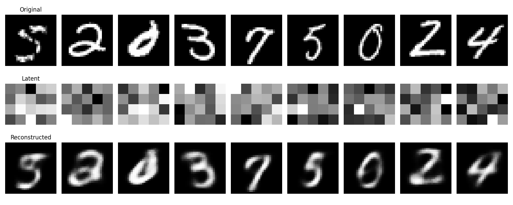
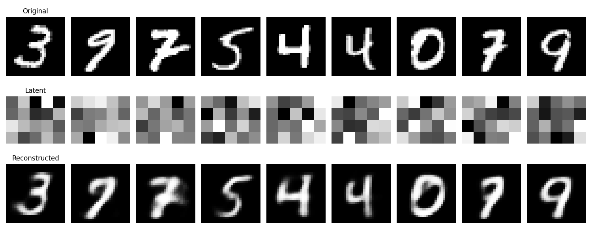
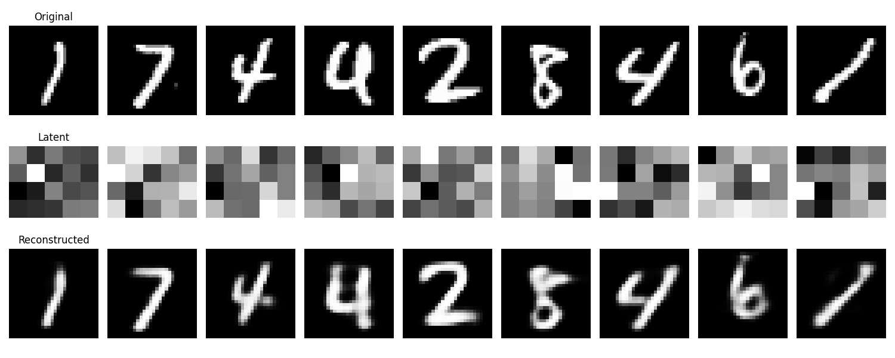
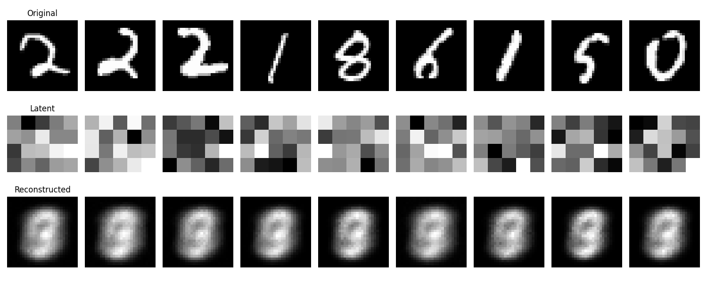
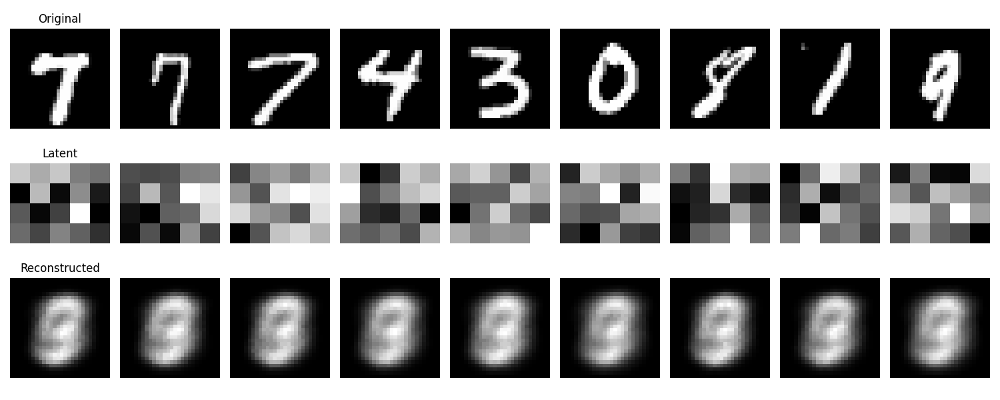
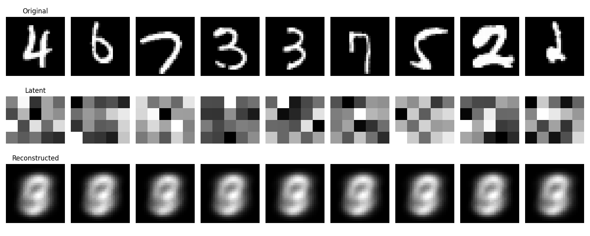

This repo contains the implementation of Linear Autoencoder, Convolutional Autoencoder, and Variational Autoencoder. The Linear Autoencoder is implemented using a linear neural network with ReLU activation functions, while the Convolutional Autoencoder uses convolutional layers with ReLU activation functions. The Variational Autoencoder uses a Gaussian prior distribution for the latent variables.

These Autoencoders are trained on the MNIST dataset. The results are shown below.

It is interesting to see that the loss functions have dramatically different performances for VAE.


## Autoencoder Linear NN
After epcho=10


After epcho=50


## Autoencoder Convolutional NN
After epcho=10



After epcho=50


## Variational Autoencoder NN
### Large performance difference between loss functions of BCELoss and MSELoss
#### criterion = BCELoss(reduction='sum')
After epcho=10



After epcho=20



After epcho=50



#### criterion = MSELoss()
After epcho=10



After epcho=20



After epcho=50



### References
```
Auto-Encoding Variational Bayes, Diederik P Kingma, Max Welling
https://arxiv.org/abs/1312.6114
```
